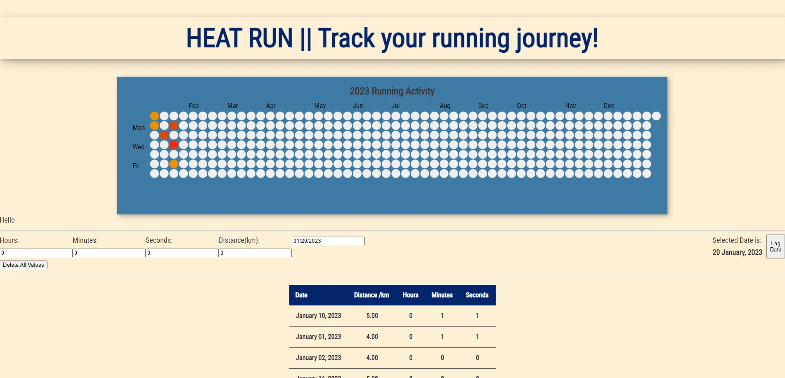

# Heat Run

Heat Run is a web application that allows users to track their running journey.

## Description

Ever since discovering the github commits heatmap, I have always wanted to create a similar app to track my running endeavours. I have found the heatmap style a good way to track my progress as well as stay motivated. Users are able to input the distance they ran on a particular day and they can see their history of runs in a table as well as on the heatmap.

### Dependencies

- react-heatmap library to render a heatmap.
- date-fns library for formatting and calculating dates.
- react-datepicker library to allow users to select a date.
- react-toastify for pleasent notifications for inputting and delete data.
- react-tooltip to allow users to see more information for each particular datapoint.

#### Tech Stack

- TypeScript
- React
- NodeJS
- Express

### Overview

### Component Tree

Check it out at [https://heat-run.netlify.app/](https://heat-run.netlify.app/)
